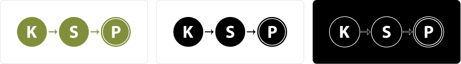
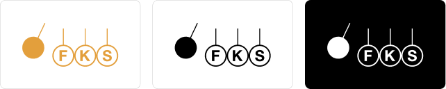

# Trojsten Brand Guidelines

## Trojsten

### Logo

Logo Trojstenu používame v troch alternatívach - modré, čierne a biele.
Ak je to možné, preferujeme použitie modrého loga. Modré logo **neumiestňujeme**
na farebné pozadia.

Grafické súbory: [SVG](trojsten/logo)

### Ikona

V niektorých prípadoch je výhodnejšie použiť miesto celého loga iba
ikonu Trojstenu. Rovnako ako logo, používame tri alternatívy:

Grafické súbory: [SVG](trojsten/icon)

### Farby

| Náhľad                           | Názov                | HEX     | Pantone |
|----------------------------------|----------------------|---------|---------|
|      | Trojsten modrá       | #1077C1 | 7461 C  |
|     | biela                | #FFFFFF |         |
|    | čierna               | #000000 |         |

### Typografia

Používame dva typy písma. Na veľké nápisy používame Reckless, na bežný text, nadpisy a pod.
používame Source Sans Pro.

Zo Source Sans Pro používame varianty black, regular a light.

Fonty:
- [Reckless](trojsten/Reckless.otf)
- [Source Sans Pro](https://fonts.google.com/specimen/Source+Sans+Pro)

## KSP

### Logo

KSP má dva varianty loga: zelené a čiernobiele. Preferujeme použitie zeleného.

Grafické súbory: [SVG](ksp/logo)

### Farby

| Náhľad                             | Názov                | HEX     | Pantone |
|------------------------------------|----------------------|---------|---------|
|  | KSP zelená           | #818F3D | 7737 C  |

## KMS

### Logo

KMS má tri varianty loga: modré, biele a čierne. Podobne, ako pri Trojstene:
Ak je to možné, preferujeme použitie modrého loga. Modré logo **neumiestňujeme**
na farebné pozadia.

Grafické súbory: [SVG](kms/logo)

### Farby

| Náhľad                             | Názov                | HEX     | Pantone |
|------------------------------------|----------------------|---------|---------|
|    | KMS modrá            | #5F7DE4 | 2718 C  |

## FKS

### Logo

FKS má tri varianty loga: oranžové, biele a čierne. Podobne, ako pri Trojstene:
Ak je to možné, preferujeme použitie oranžového loga. Oranžové logo **neumiestňujeme**
na farebné pozadia.

Grafické súbory: [SVG](fks/logo)

### Farby

| Náhľad                                | Názov                | HEX     | Pantone |
|---------------------------------------|----------------------|---------|---------|
|  | FKS oranžová         | #E39F3C | 715 C   |